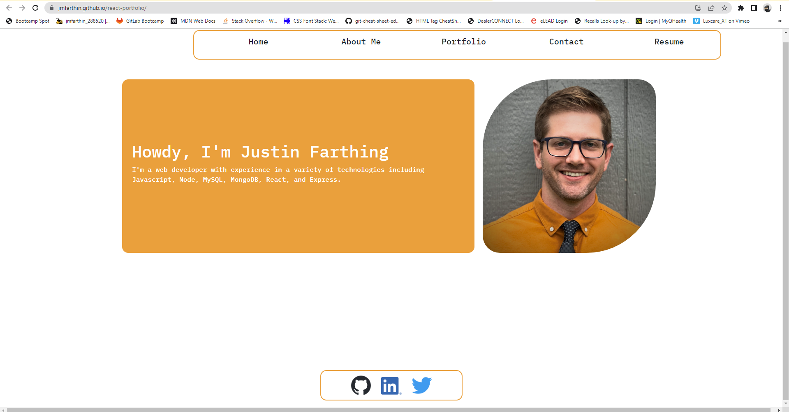
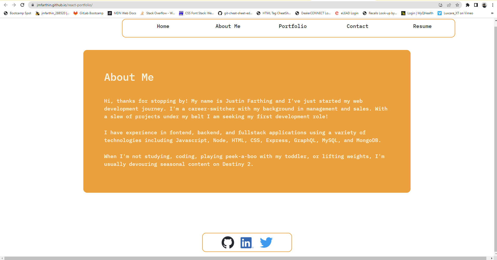
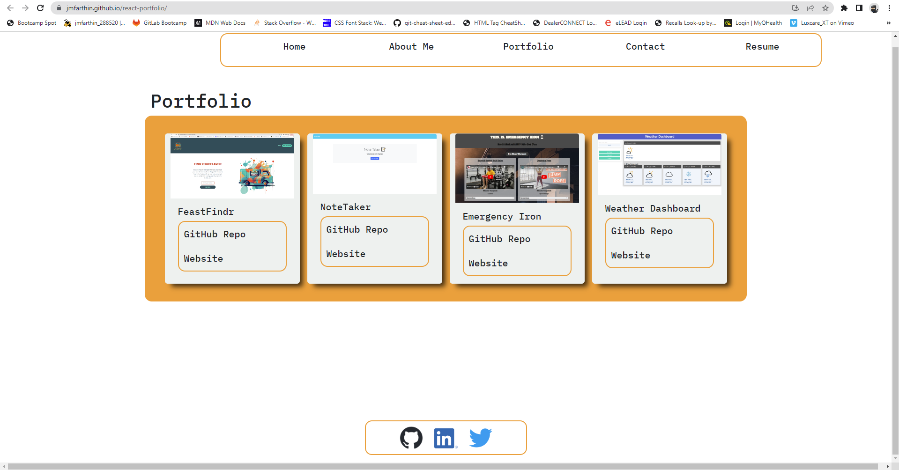
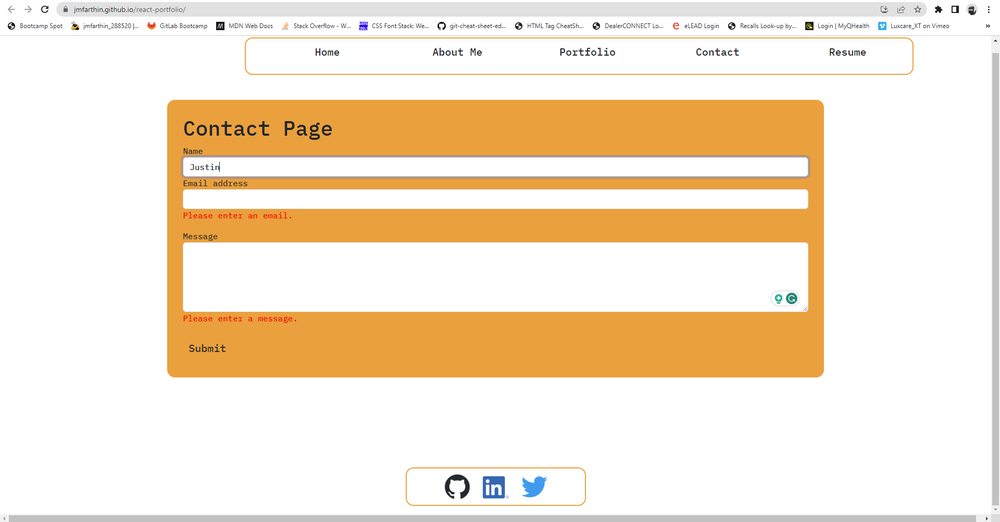
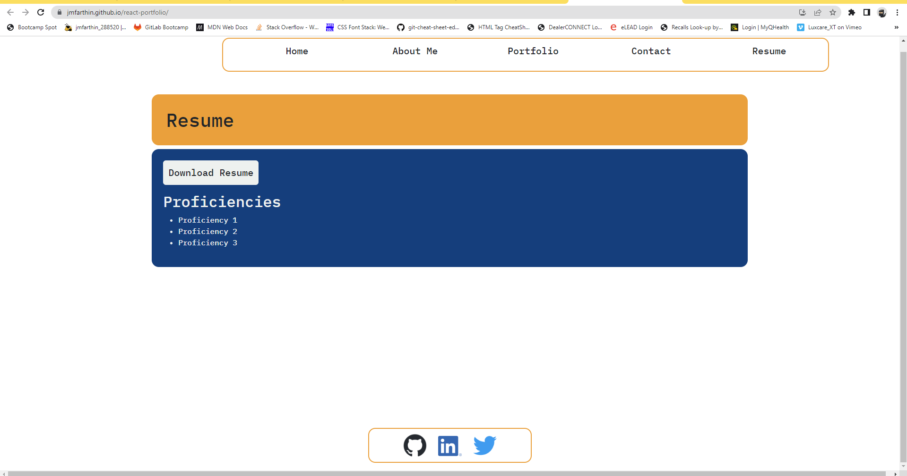

# react-portfolio
This repo contains code for my portfolio created in react.

## Description

This project is my Portfolio that I created in React.js. It's purpose is to showcase my current knowledge of web development and highlight my proficiencies and showcase many of my projects. 

## Usage

To view portfolio, visit: https://jmfarthin.github.io/react-portfolio/

Repository: https://github.com/jmfarthin/react-portfolio.git

Check out the About Me section to learn a little about me and then head over to my Portfolio to see some of the apps I've built or helped build. If you have any questions, please contact me using the form in the Contact section. For my work history and proficiencies, please look the Resume section!

### Screenshots of deployed website:

# Credits

Thank you to Alex Gonzalez for his help with the Page Provider.

## License

Licensed under the general usage MIT license.
Copyright (c) 2023 Justin Farthing